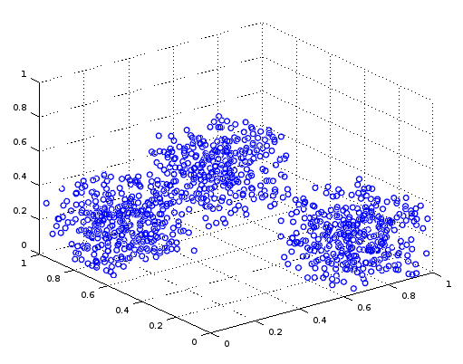
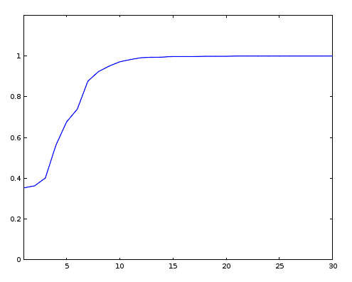

# Multiclass Color Classifier

In this exercise we will be designing and developing a color classifier in Octave. More precisely, we have a feature space $\mathcal{C}​$ of color samples, isomorphic with the set $[0,1]^3​$. That is, a color sample can be interpreted as a tuple of three elements, each one being a real number between $0​$ and $1​$. Given a color sample $c \in \mathcal{C}​$, then there is an associated category $\mathrm{cat}(c)  \in \mathcal{G}​$, where $\mathcal{G}​$ is the set of all categories. Categories may be defined just to fit our purposes; after defining a set of categories we will need to classify all samples in an appropriate dataset for them to be used to train the classifier we will be coding.

So, for example, suppose we define categories $\{\text{RED-ISH}, \text{GREEN-ISH}, \text{BLUE-ISH}\}$; then we may have, for example, a tuple $(1.0, 0.2, 0.1) \in \mathcal{C}$ ; if we use RGB encoding, then the intensity of red, green and blue light may be, respectively, the first, second and third features. Then, this particular tuple may possibly be classified as $\text{RED-ISH}$.


### Generating a Dataset

We will first begin by generating a random dataset we can use to test our algorithms. For this purpose, we may just use the following Octave script:

```octave
function x = generate_features(r_c, r_d, g_c, g_d, b_c, b_d)
  r = r_c + (1 - 2*rand())*r_d;
  g = g_c + (1 - 2*rand())*g_d;
  b = b_c + (1 - 2*rand())*b_d;
  x = [r, g, b];
end

function [sample, category] = generate_redish()
  sample = generate_features(0.8, 0.2, 0.2, 0.2, 0.2, 0.2);
  category = 1;
end

function [sample, category] = generate_greenish()
  sample = generate_features(0.2, 0.2, 0.8, 0.2, 0.2, 0.2);
  category = 2;
end

function [sample, category] = generate_blueish()
  sample = generate_features(0.2, 0.2, 0.2, 0.2, 0.8, 0.2);
  category = 3;
end

function [sample, category] = generate_sample()
  persistent f = {@generate_redish, @generate_greenish, @generate_blueish};
  persistent l = length(f);
  [sample, category] = f{randi(l)}();
end

function [X, y] = generate_dataset(samples)
  X = [];
  y = [];
  for i = 1:samples
    [s, c] = generate_sample();
    X = vertcat(X, s);
    y = vertcat(y, c);
  end
end

[X, y] = generate_dataset(1000);
scatter3(X(:,1), X(:,2), X(:,3));
```


Executing the script produces a picture like the one below; we can easily identify three clusters, one for each category:




### Classifier Design

To train our classifier we will use a one vs all strategy based on logistic regression. Given a dataset matrix $X \in \mathcal{C}^{\,n\times 3}​$ of $n​$ color samples, with each row of $X​$ being a feature vector, and a parameter matrix $\omega​$, we may define
$$
f(X; \omega) = \frac{1}{1 + \exp(-X \omega)}
$$
where the logistic function is applied component-wise. Given $X$ the application of $f$ produces an $n$ by $3$ matrix $\hat{Y}$. Each row of this matrix corresponds to a sample, and each column corresponds to a classifier. For the $i$-th sample, the predicted class will be $j$ such that $\hat{Y}_{i,j}$ is maximum.

For training we will be using gradient descent. Given a matrix $Y$ where the $j$-th column is the vector of expected outputs for the $j$-th classifier, and assuming logarithmic error, our update rule will be the following:
$$
\omega \leftarrow \omega - \frac{\alpha}{n} X^\mathrm{T} \left[\, f(X; \omega)  - Y \,\right]
$$


### Implementation

Let us now analyze all required functions one by one. The first one we will implement is the sigmoid function and it does not require too much explanation:

```octave
function sigmoid = sigmoid(x)
  sigmoid = 1/(1 + exp(-x));
end
```

This function will be applied component wise to the matrix $X\omega$ when computing $f$, as shown in the following definition:

```octave
function f = f(X, omega)
  f = arrayfun(@sigmoid, X*omega);
end
```

Now we may define the descent function, which we will call `gd` . Given the training set $X$ and a matrix $Y \in \{0, 1\}^{n\times 3}$ such that $Y_{i, j}$ is the class that should be assigned to the $i$-th training sample by the $j$-th classifier, we may write:

```octave
function omega_next = gd(X, Y, omega)
  persistent alpha = 0.5;
  n = rows(X);
  omega_next = omega - (alpha/n)*X'*(f(X, omega) - Y);
end
```

Given an expected output vector $y \in \{1, 2, 3\}^n$ for some dataset, we may generate an appropriate matrix $Y$ by means of the following procedure, which we will call `decompose` : 

```octave
function [Y, y_max] = decompose(y)
  Y = zeros(length(y), 3);
  for i = 1:length(y)
    Y(i, y(i)) = 1;
  end
  y_max = max(y);
end
```

Now, before actually writing the training procedure, we may also want to define two additional functions which will allow us to measure the progress of the training mechanism and the effectiveness of the model:

```octave
function y = predict(X, omega)
  Y_hat = f(X, omega);
  [v, y] = max(Y_hat, [], 2);
end
```

```octave
function rating = validate(X_validation, y_validation, omega)
  y_predicted = predict(X_validation, omega);
  delta = y_predicted - y_validation;
  rating = sum((delta == 0)(:))/size(X_validation)(1);
end
```

The first function `predict` will actually generate an output vector given a dataset $X$ and a parameter matrix $\omega$. The call to $f$ will produce an $n$ by $3$ matrix; as it was implied before, the $i$-th row will be a vector such that the $j$-th component is the the probability predicted by the $j$-th classifier of the $i$-th sample being of class $j$. Now we want to collapse these predictions into a single vector, so we will take the index $j$ of the prediction with the highest value as the actual prediction of the overall classifier.

The second function will actually measure the fraction of samples being correctly classified, given some validation dataset $X_\text{validation}$, a corresponding label vector $Y_\text{validation}$, and the parameter matrix $\omega$.

Now we have what we need to implement our training function:

```octave
function [omega, rating_t] = train(X_training, y_training, iterations)
  [Y_training, y_max] = decompose(y_training);
  rating_t = zeros(1, iterations);
  omega = rand(size(X_training)(2), y_max);
  for i = 1:iterations
    omega = gd(X_training, Y_training, omega);
    rating_t(i) = validate(X_training, y_training, omega);
  end
end
```

This function will first decompose the given label vector into a matrix to be used by the gradient descent algorithm. Then it will iterate for a fixed count, and for each iteration it will measure the rating of the classifier. We may now test our classifier with a simple script:

```octave
[X_t, y_t] = generate_dataset(1000);
[X_v, y_v] = generate_dataset(200);

[omega, rating_t] = train(X_t, y_t, 30);

plot(1:length(rating_t), rating_t);
disp(validate(X_v, y_v, omega));
```

This last call displays a perfect score of $1$, which of course means that our model classified all elements of the validation dataset correctly. In addition, we have the following plot of the evolution of the rating with the amount of iterations:



We can see the score approaching $1$ as iteration count increases. For the first few iterations the score is close to one third; this makes sense since the classifier is classifying samples pretty much at random. By the 15th iteration, however, we can see that it has pretty much converged and there is no real use in keeping up with the training. Wasting time iterating could have been avoided by adding a break condition to the training procedure: if at the end of the iteration score has not increased by more than some amount $r$, then stop training and return results.


### What is Next?

This exercise did not deal with any of the following topics:

* **Random noise in the dataset** : the generated dataset was very clean and there were no incorrectly classified samples; adding random outliers in some proportion $p$ would increase difficulty and require the implementation of additional cleanup procedures.
* **Inseparable data** : the generated dataset was separated easily; the sample clusters were neatly spaced from each other and  the adopted model had no problem dealing with them; overlapping clusters, on the other hand, would increase difficulty and make the classification problem more interesting.
* **Regularization** : features were neatly scaled and there was no need to apply any kind of transformation; generating datasets on different scales may require instead the implementation of additional steps to adjust the statistical parameters of each feature, in addition to terms to keep weights small.
* **Overfitting** : since data could be separated easily, generalization was not difficult and there was no trade off between training precision and validation precision; taking training and validation datasets from slightly different distributions could introduce the possibility of overfitting, making the problem harder and more interesting.